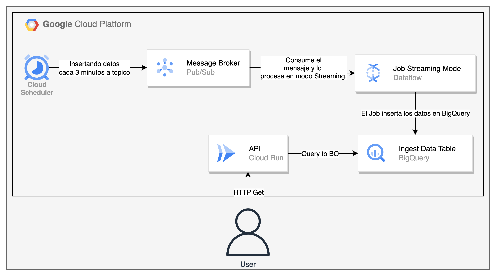

## Sistema para Ingestar datos a BigQuery y traerlos mediante una API.

### Resumen

La idea de este sistema, es Ingestar informacion a BigQuery, usando un proceso PubSub.
El objetivo de este repositorio, es mostrar mi desarrollo para un sistema que Ingesta archivos en BigQuery, utilizando la siguiente arquitectura:

- Data source. Para simular una fuente de datos ingestando en el topico, utilize Google Cloud Scheduler para ingestar datos cada 3 minutos en el topico PubSub.
- Sistema de Mensajeria Google Cloud Pub/Sub.
- Servicio que procesa Informacion, en este caso, en tiempo real, Google Cloud Dataflow.
- Base de datos OLAP, Google BigQuery
- API Para consumir datos desplegada en Google Cloud Run, que tendra un endpoint para el consumo de los mismos.

### Distribucion del Proyecto.

#### IaC

El codigo fue desplegado usando Terraform como herramienta para Infraestructura como Codigo. Se utilizo la siguiente estructura:

- main.tf - Contiene el codigo que va a desplegar la infraestructura en GCP.
- outputs.tf - Contiene salidas que voy a querer para almacenar.
- variables.tf - Definicion de las variables a utilizar.
- remote_state.tf - Bucket remoto que va a almacenar el estado de terraform.
- terraform.tfvars - Definicion de valores para variables.

#### API

Contiene el codigo de la API que va a ser utilizado para el consumo de datos a BigQuery. Se desarrollo utilizando el patron MVC, en donde tenemos la siguiente estructura de carpetas:

- main.py - Inicializador de la API, en donde va a llamar al metodo que contiene todas las rutas.
- routes/bigquery_router.py - Aqui se incluiran todas las rutas disponibles para interactuar con BigQuery.
- controllers/bigquery_controller.py - Dentro de la arquitectura MVC, el controller es el encargado de realizar las consultas con el modelo y validar el tipo de dato de respuesta, para cumplir con el "contrato" que hemos realizado con el "frontend". Tambien se encargara de validar, de ser necesario, que si tenemos alguna consulta en donde venga informacion mediante el body de la consulta (usando el metodo POST), los datos sean validos y sean los requeridos por el endpoint. Este controller va a interactuar con el modelo.
- models/bigquery_models.py - Dentro de la arquitectura MVC, el archivo models es el encargado de interactuar con la base de datos. Este recibira las consultas validadas por el controller y hara las consultas a la base de datos. Luego devolvera la informacion requerida al controller en donde este se encargara de validar que esta es valida.
- serializers/bigquery_serializer.py - La utilizacion de serializadores, en este caso Pydantic, es muy necesaria para tener persistencia entre  las consultas y respuestas a la API. Con el uso de los mismos, haremos que todas las consultas que se hagan a la API, tengan solamente los campos requeridos, y en el caso de las respuestas, estan tengan siempre el mismo esquema.
- test.py - Script utilizado para testear la aplicacion. En este caso se utilizo la libreria pytest. En este caso, siempre es necesario testear y realizar mocks de las consultas externas a el funcionamiento interno de la API, en este caso, la consulta a BigQuery.

#### CI/CD

Para el caso de este proyecto, se debe integrar un archivo con extension .yml dentro de la siguiente estructura de carpetas:

```
.github
└── workflows
    ├── deployment.yml
    └── testing.yml
```

El objetivo de la Integracion y Despliegue Continuo, es lograr que automaticamente se hagan las siguientes tareas:

- testing.yml - Ejecutar los test para cada cambio que haga en la API no afecten al codigo. Este se va a ejecutar con cada PUSH y cada PR solicitado.
- deployment.yml - Se encargara de desplegar el codigo al entorno de CloudRun. Cabe destacar para el caso de esta aplicacion, tenemos un solo entorno, que se el de desplegado por terraform. Este generara una nueva imagen Docker, la subira al Artifact Registry y luego actualizara la instancia de CloudRun con esta ultima imagen.

#### Arquitectura



### Inicializacion del Proyecto.

#### Requisitos para el ejecutar el proyecto.

Se deben cumplir los siguientes requisitos para ejecutar el proyecto.

- Python 3 version 3.8
- Terraform instalado
- gcloud instalado y configurado
- Dentro del proyecto de GCP, tener habilitado la API de Dataflow, Container Registry, BigQuery Api Y Compute Engine API.
- Docker (Para pruebas locales)
- Docker Compose (Para pruebas locales)
- Tener una service account en formato Json, para que pueda ser utilizada por la API y por Terraform. Esta se debera llamar service_account.json
- Crear un bucket en el proyecto GCP para que terraform guarde los estados alli. Luego modificar el archivo remote_state.tf con el nombre indicado.
- Setear la variable de entorno GOOGLE_APPLICATION_CREDENTIALS con la ubicacion de esta SA.

#### Pasos para desplegar la infraestructura en GCP.

Para ejecutar terraform, se deberan seguir los siguientes pasos:
```bash
cd terraform
terraform init
terraform plan
terraform apply
```

#### Pasos para ejecutar la aplicacion localmente.

Para ejecutar la API local, se deberan seguir los siguientes pasos:
```bash
cd api
docker-compose up -d
```

Para realizar una prueba, se puede ejecutar un CURL indicando el ID.
```bash
curl --location '0.0.0.0:8000/api/v1/{id}'
```
Como respuesta obtendremos la data que se ingesto en BigQuery con el ID solicitado.

#### Pasos para utilizar CI/CD para ejecutar la aplicacion usando CloudRun

Se debera hacer un commit y solicitar el respectivo PR a rama main (en este caso porque no tenemos un entorno de desarrollo). Una vez realizado este, si los test se ejecutan correctamente, este se desplegara en CloudRun y obtendremos un Endpoint para poder realizar las consultas.

### Mejoras realizables al proyecto

#### Infraestructura
- Con el objetivo de tener diferentes ambientes, se podria mejorar el IaC para que se desplieguen diferentes ambientes usando los mismo archivos. Este desplegaria los siguientes ambientes:
  - Desarrollo
  - Testing
  - Produccion
- Realizar el despliegue de la Aplicacion de CloudRun utilizando terraform y dos service account, una encargada de realizar las consultas a BigQuery, que tendra los respectivos permisos, y otra que sera dada al servicio que consultar a la API, con permisos de invoker, para que solamente usando esta cuenta de servicio se pueda realizar consultas a la API y no afecte a otro servicio de GCP.
- Utilizar CICD con sus respectivos secretos, para automatizar los cambios en infraestructura cada vez que se necesiten y que nosotros (DevOps) no tengamos permisos para modificar la infrastructura, lo ideal es que CICD tenga la service account para que solamente esa pueda modificar la infra.

#### API
- Si vamos a tener una mayor carga, se consideraria utilizar explicitamente async/await (asyncio) para obtener un mayor rendimiento.

#### CI/CD
- Para tener una pipeline que se adapte a cada environment creado, una mejora seria modificar la pipeline, para que dependiendo de la branch adonde estemos pusheando codigo, esta despliegue en ese entorno en la nube, por ejemplo si pusheamos a staging, la pipeline debera actualiar la instancia de CloudRun de Staging, asi mismo con main (produccion).
